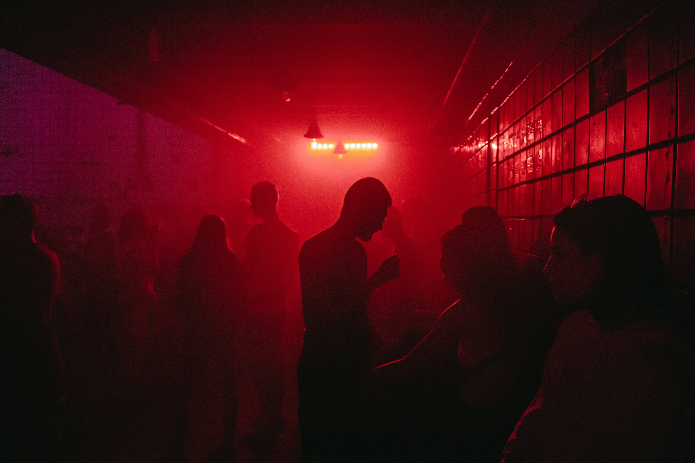
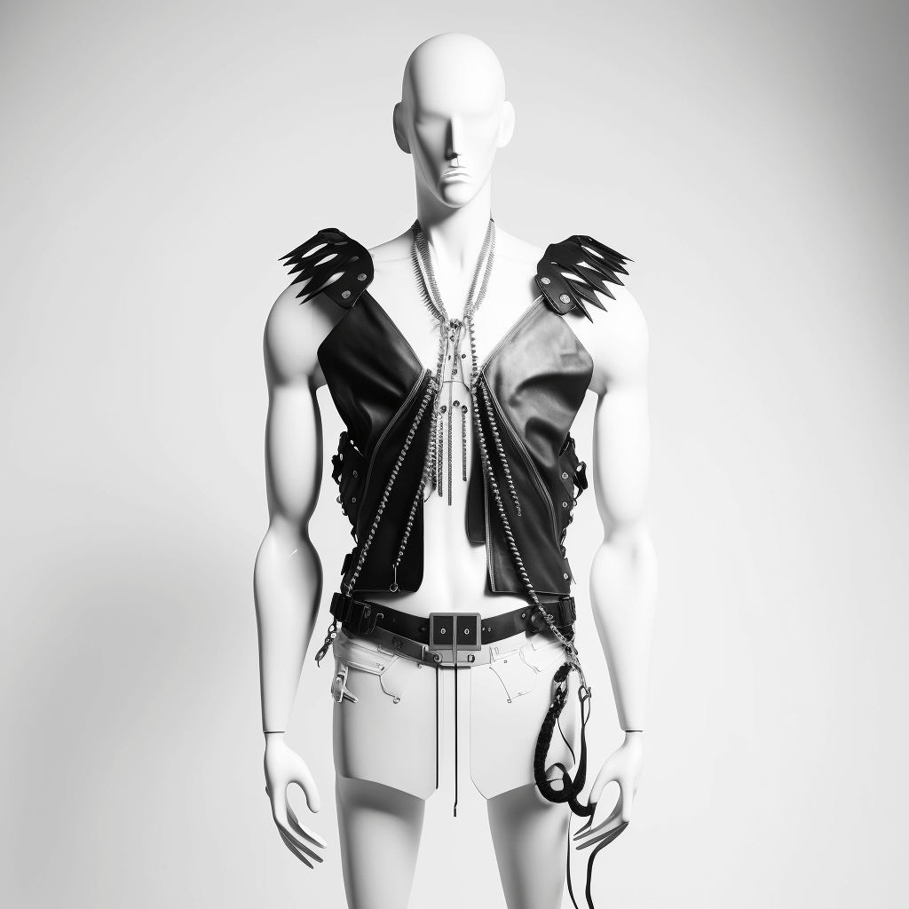

The difference over the years was staggering. Being back at a [Synoid party](https://ra.co/promoters/59510) after 3 years felt as if I walked into a fetish store, while expecting a skate crowd. Everywhere I looked, party-goers were decked out in fetish-wear, a sight that was once reserved for the deep of night and late Sunday evenings. It wasn't until I met a co-clubber hiding from the rain that it clicked.

"Berlin clubbing is so boring right now" she said as a couple in full see-through fishnet clothing walked by. "Everyone is wearing freedom but no-one is acting like it". That confused me.

She looked like an experienced clubber, somewhere in her 40s with snow-white hair. "Back in the day you would see people enjoying each-other left and right. But look at the darkroom here, there's no-one there."

The club that originally hosted Synoid is [now destroyed](https://groove.de/2021/02/03/griessmuehle-farewell-sonnenallee-zehn-anekdoten-aus-acht-jahren-2/) in favor of fancy office buildings. This party was my first time discovering the follow-up of that club: [RSO](https://rso.berlin/). On our exploration through the club we found staircases to under the dancefloor. The dancefloor was full, the space under it was empty. She just told me what it was.

"Everyone is wearing freedom but no-one is acting like it" made sense now. The new crowd seems to feel comfortable wearing the gear, but not interested in acting the gear.

If you scroll [through techno TikTok](https://www.tiktok.com/tag/technotiktok?lang=en) right now the looks are very similar; fishnets, chainlinks and black. [Big fashion brands](https://nakt-studio.com/) exist around the style. Even AI can spit out the looks:

The soul of the Berlin club scene is beautiful; the freedom of being. You do you, and we'll love it. The new generations are more [risk-averse than ever](https://www.theguardian.com/society/2022/aug/19/generation-sensible-risk-missing-out-life-experiences-therapists). Hopefully they will live through Berlin clublife with the same sense of freedom as the previous generations.

Empty darkrooms with full dancefloors make me worry though.

