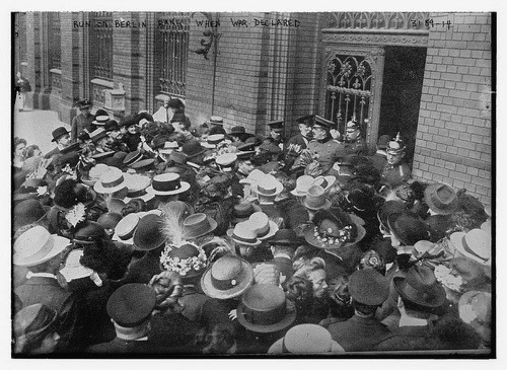

Crisis hits; Coinbase loses all it's cryptocurrency and the next day a critical vulnerability is found in Bitcoin. Ether's price plummets by 80% to \$60.

What happens if stakers in Ethereum 2.0's new Proof-of-Stake want to sell their staked crypto? What does a Ethereum Bankrun on the stakes look like?

## 🤔 Understanding Ethereum's Stakes

It's important to note that Ethereums stakes are **mission-critical** to the network's workings. It needs to be difficult to validate transactions, either by doing a lot of calculations (proof of work) or by 'locking' money (proof of stake).

The difficulty of validating ensures the legitimacy of data. If validating would be easy I could hijack the validation process (a 51% attack) and transact all the currency to myself.

So why would a hypothetical bank-run be so destructive? If the amount of Ether staked gets really low and cheap; 51% attacks get easier. Let's look at an example:

The stakes pre-crisis are worth $300 million. It would cost more than $300 million to perform an attack. Crisis hits; price drops 80% to \$60 and 60% of stakers withdraw their money.

That would mean there's $24 million left on the stakes. Therefore, giving an attacker willing to lock up (not even spend) $24 million dollars worth of Ether the possibility of getting control of a nearly \$7 billion economy at that time. [Little less than 100.000 households in the US could pull off such a stunt](https://dqydj.com/how-many-millionaires-decamillionaires-america/).

Instant 28352% return with no risks. I don't take into account further price drops and exchange lockups, but with the [Ethereum Classic's 51% attacks](https://www.coindesk.com/ethereum-classic-blockchain-subject-to-yet-another-51-attack) we didn't see massive price shifts anyway.

## 😱 So, is a bankrun possible?

Yes. You might've heard of the 27 hours delay

Exit: minimum waittime 25.6 minutes; for every 4 people in queue another 6.4 minutes. Then the exited nodes don't have to validate anymore. They'll be able to pick up their money 27 hours later but validating isn't necessary.

Let's say we have 32.5k validators. If 60% of them withdraw it's 19.7k validators leaving. That would be a queue of (19.660 validators / 4 per slot \* 384 seconds) = 21.8 days.

- The less Ether is staked; the more free Ether you get for staking.
- If there is no withdraw queue; you'll need to wait 27 hours. If

## 😄 Risk averted, right?

The bankrun risk; yes. But, 51% attacks becoming easier once price drops is still a risk in itself. But with the bankrun risk gone we're at least not compounding it.
