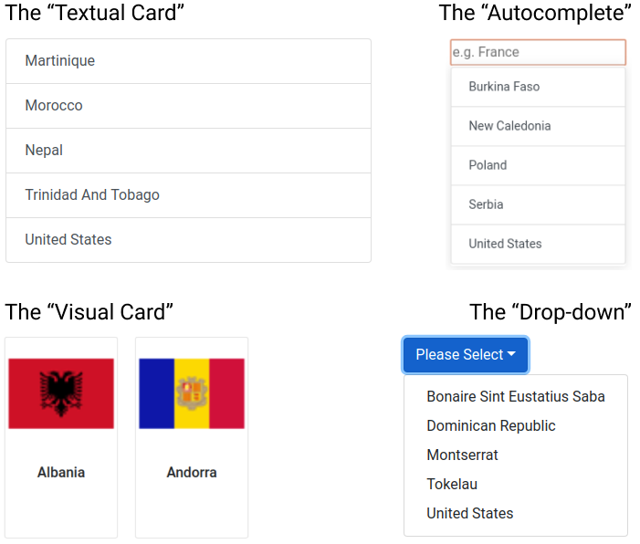
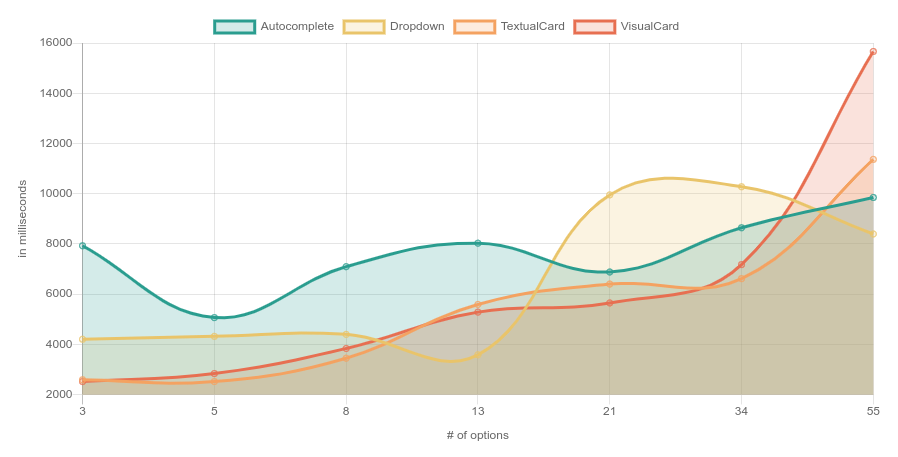
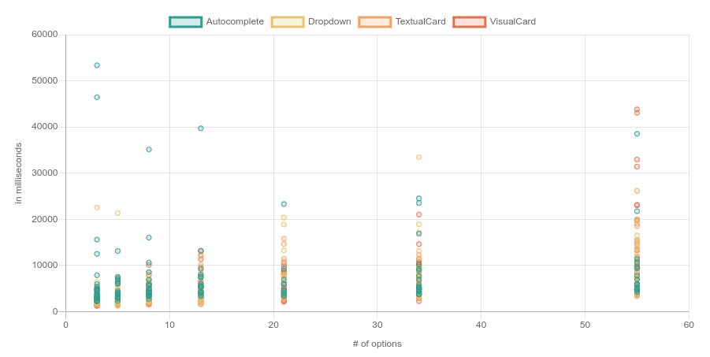
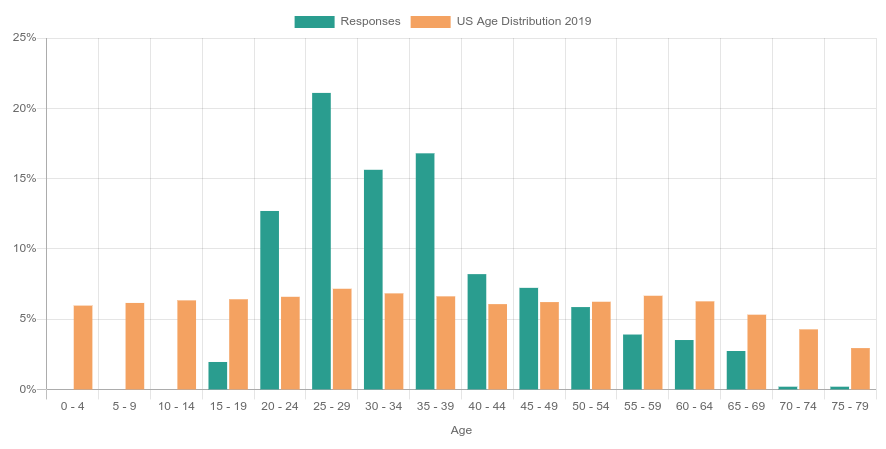
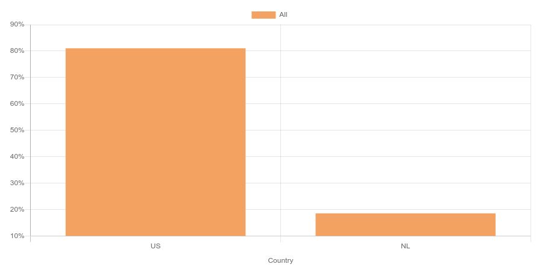

Scroll scroll scroll. Going through forms and having to open a dropdown to select your country, or even worse, gender can be time consuming. I’ve been wondering how time consuming exactly and whether some select types are better. So I thought; let’s run an experiment!

I quickly hacked together some code and let over 500 unique users fill in a form asking for their age and country. The app asks users to select their country from 3 to 55 options (Distributed according to the Fibonacci sequence, because I like Fibonacci 🤓 ). The app shows either of the following four types of select interactions:

The results were as follows (click on the image to open the actual chart):

## Why does the drop-down spike at 21 options?

Since all the respondents were from the States (I had to guarantee one option somehow) and the “U” is low in the alphabet, my assumption is that somewhere above 13 options is when the option started to fall off the screen.

## Why is autocomplete so high?

That’s also what baffled me, I expected this to be the fastest way to do a select when there are many options. There are two hypotheses:

1. Most people started looking for “The United States” which would fail because the country is marked as “United States”.

2. The interaction of the autocomplete is difficult. After user-testing the experiment with friends some said they didn’t know whether they had to click the option, press enter or do another interaction.

In a scatter plot you can clearly identify that a good amount of people who had to use the autocomplete interaction struggled to select their answer.

The “Autocomplete” outliers were at least three times as frequent as the others.

- Autocomplete: 10 outliers (shown in chart)
- Dropdown: 3 outliers (not shown)
- Textual card: 3 outliers (not shown)
- Visual Card: 2 outliers (not shown)

Since the autocomplete outliers were overrepresented, I assumed that the autocomplete were caused by something else than maleficent intent and decided not to remove the autocomplete outliers in the data-cleaning process (explained further down).

💡 Idea: re-run the experiment with “The” in front and a nudge to let users know they have to click the option. But, since I used Mechanical Turk to source the responses and this is just a fun experiment, it wasn’t worth the 💰!

## What are some biases?

A quick experiment doesn’t come without biases. First off, the ages of 20-49 are over-represented;

💭 Thought: the data of this experiment is representative for you if your demographic matches these responses. If your user’s age distribution is very different you might want to consider re-running the experiment yourself for your demographic! Feel free to use the code here!

Also, over 80% of respondents is from the US 🇺🇸, with the rest being Dutch 🇳🇱 (I trialed it first with friends!).

💭 Thought: since users had to select their country, the positioning of “United States” and “Netherlands” in a list might have introduced a bias in the data.

## Data Cleaning

Of course there were also some jokers 🤡! I removed any response where:

- The age was negative. There were no positive age-outliers.
- The country was neither US or Dutch (in MTurk only US participants could answer, thus I feel safe removing other countries).
- Anyone whose time-to-completion was very extreme (e.g., some people took 1.5 minutes to select their country, wow!). As explained earlier I did leave the autocomplete outliers in.

## Conclusion

With an average of 18 data-points for each combination there is too little data to make strong recommendations, but I’m going to try anyway:

- 8 or less options? Avoid drop-downs & auto-completes, just use a single-interaction method; the textual or visual cards!
- Have over 55 options? Go for the auto-complete and save your users a bunch of headache 😊. Make sure to clearly communicate the required select interaction though, such as ‘Enter’ or a click!

Want to check out the results yourself? Check out all visualization [here](https://select-experiment.vercel.app/results)! Want to run the experiment yourself? Check out the code [here](https://github.com/bvanderdrift/select-experiment)! Looking for the raw JSON pre-cleaning to do your own analysis? Go [here](https://select-experiment.vercel.app/results/json)!
