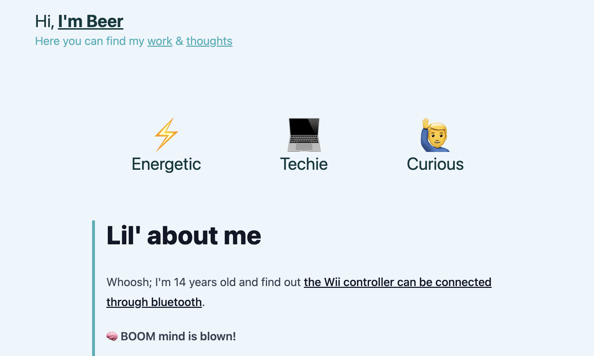

One thing I can't do; is make things look pretty like a designer. I can build; I can learn about what users need and I can prioritize. I can *not* design.

Believe me, I tried. [The first iteration](https://web.archive.org/web/20240705150634/https://its.beer/) of this portfolio looked bad. Look at these colors:

When AI turned the corner; it was time to take this project and revamp it to really learn how replaceable I am. My [talented friend Wouter](https://www.wouterraateland.nl/) built [a small 30-seconds game](http://quickfire-guessplay.lovable.app/) using the [Lovable AI Fullstack Developer](https://lovable.dev/).

I had my tech, I had my goal. Time to fire this up.

## The initial delivery

I gave it the following requirements:

> * Loading of page should be ultra fast. So either static content or server-side rendered content is key.
> * I want content management to be done by raw files in the repo; no DB/online tools. Happy to recompile & deploy when updating content.
> * I want to be able to list my experiences by JSON. It needs to have tech keywords, description, company title (with link to their LinkedIn) and my title at the company. It should also include an icon.
> * I want to have a blog section where I can write using markdown. Ideally I'd have a folder where if I dump markdown it'd show up as a blogpost. It's important I can commit draft blog posts to that folder without having them released on my website.
> * The site should brand me as 'fast, pragmatic, energetic & fun' through it's styling.

## First impressions

Within about 1 minute the AI was done. Honestly; it was a little impressive. A good looking, but generic, website was put into place. I could click through it. Even better it: was written to a GitHub repo, where I could add to, which the AI could immediately use.

Folders were clearly named and files were split in logical ways. The code was of mediocre quality but acceptable.

## Pain points

On the other hand, there were a few major issues.

* The site was not fast. It wasn't either static content, or server-side rendered. It ignored my instructions there.

* The blog pages were crashing. Turns out the AI hadn't set up Markdown loading at all, so the renderer errored not knowing what to do with `.md` files.
* Once the AI fixed the markdown issue after prompting, the images all were erroring. Upon inspection typescript was already highlighting this issue. After prompting AI, it didn't fix it. I had to step in and do [a relatively simple fix](https://github.com/bvanderdrift/fasttrack-portfolio/commit/f8de18de2f7dfd1811c01808507186c1346b744b) to get it working. Surprisingly AI could not fix this themselves.
* It left a bunch of unused variables in the code like [here](https://github.com/bvanderdrift/fasttrack-portfolio/blob/380d643de4e846b32779a45432ffafea8684e4a5/src/pages/BlogPost.tsx#L21) and [here](https://github.com/bvanderdrift/fasttrack-portfolio/blob/380d643de4e846b32779a45432ffafea8684e4a5/src/components/WorkCard.tsx#L23)
* It set `any` types to already typed variables like [here](https://github.com/bvanderdrift/fasttrack-portfolio/blob/380d643de4e846b32779a45432ffafea8684e4a5/src/pages/Work.tsx#L29)
* [It added dependencies](https://github.com/bvanderdrift/fasttrack-portfolio/blob/380d643de4e846b32779a45432ffafea8684e4a5/src/App.tsx#L5-L6) that were not needed or used.

## Where it all broke down

After manual fixes I started prompting the AI to make a superficial changes: have all external links open in a new tab.

**This is where the horror started**

In a single prompt, it did two things:

1. It broke the images in the markdown again by re-introducing the type issue.
2. It broke the markdown rendering again, in a different way than the first and not caused by changed links.

I ended up throwing the new commit away fully. At this point I lost faith in Lovable to be trusted with the codebase, and went full manual mode for finishing the project.

## Fundamental limitations of LLM

LLMs are in its core really good auto-completers. But, they are not action-oriented like humans in nature. The AI doesn't seem able to self-check it's code.

The image issue would've been detectable running `tsc`. The markdown issue would've been detectable by running the code and visiting the pages.

Now, many recent improvements on LLMs are adding prompts to your prompts. [Take deep research for example](https://openai.com/index/introducing-deep-research/); on trying it myself I noticed it would break down work, probably by having given an extra prompt like:

> Please break down this prompt into smaller sub questions

Then, each sub question would be ran by a separate AI thread, which in the end is being combined again.

## Leverage LLMs power; don't provide guard rails

This feels like a wrong approach. We shouldn't add prompts as a company to guide the AI.

As developers we are very text-focused in our workflow. Not only is code one of our outputs, but also working with the terminal.

Therefore, I'd expect the AI to itself figure out that after writing code you should run `tsc` to check for errors, **before** delivering the code. I can imagine an AI also looping between code -> terminal -> code -> terminal -> code -> ... until it settles on a stable state could improve the output.

## Meaty vs Digital developers

Seeing such TypeScript mishaps I would not even expect a junior developer to make. But the way the code is structured I see good practices from a mid-level developer.

The digital developer delivered 80% of the work, but could not bring itself to perfect the last 20% needed and honestly seemed to get lost an degrading the code. That's where us meaty developers come in for now. That's also where AI will have to prove itself before we can call it a fullstack developer.