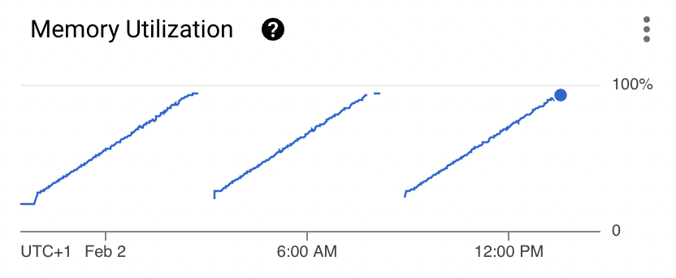
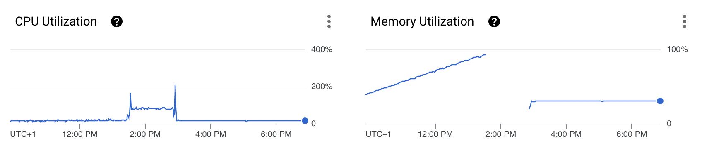

This week I embarked on the journey of migrating my codebase from [`web3`](https://www.npmjs.com/package/web3) to [`ethers`](https://www.npmjs.com/package/ethers). With sweaty hands and a head full of worries I started. But victory! My fears were not necessary. The journey was relatively smooth, and we're in happier lands now.

Considering it? Read on!

### But why?

A service I was running kept crashing. Taking a look at the monitoring dashboard quickly showed the evil.



Classic signs of a memory leak. Nightmares. It was time to bring out the big guns: 

`node --inspect`

Yay for it's existence! 🎉.

There it was, exposing itself without shame. Take a look; grey is memory that has been freed by the garbage collector, purple what remained in memory.


The inspector gives you a nice breakdown of what memory was 'retained', which pointed towards a `(closure)` that was caused by `setProvider`. [It's a known issue](https://github.com/web3/web3.js/issues/3042)!

It's 3 years since the issue's creation, and sadly the leakage is still out in the wild. I was at a crossroads:

1. Left: refactor to create all `Contract` instances only when truly needed
2. Right: refactor to use `ethers` over `web3`.


Since my service has a dynamic config that updates frequently and refers to many different contracts, choosing 1. meant choosing a slower death. If `Contract` instances are going to live forever, at one point memory would fill up.

We could always restart the service, it's stateless. But that meant depending on extra infrastructure with extra maintenance.

I decided to time-box and go for the `ethers` migration.

### The right path

Whereas in `web3` the difference between read-only and write actions is between `.call()` and `.send()` that difference in `ethers` is split by `Provider`s and `Signer`s.

`Signer`s can hold a `Provider`. You can in turn pass a `Signer` or a `Provider` to a `Contract`, which will determine whether a call to a function that alters state will be simulated or not.

```js
// web3
const web3 = new Web3('https://...');
const contract = new web3.eth.Contract(abi, '0x...');
// Simulates
contract.methods.transfer('0x...', 1).call();
// Use this to build a transaction
const data = contract.methods.transfer('0x...', 1).encodeABI(); 

// ethers
const provider = new JsonRpcProvider('https://...');
const wallet = new Wallet('0x...', provider);
// Simulates
new Contract('0x...', abi, provider).transfer('0x...', 1);
// Sends transaction 
new Contract('0x...', abi, wallet).transfer('0x...', 1); 
```

`web3` has a clearer split. I would use [`.encodeABI` ](https://web3js.readthedocs.io/en/v1.2.11/web3-eth-contract.html#contract-encodeabi) to create a transaction which I would sign with a `Wallet` and then send off with `Web3`.

`ethers` seems to push for calling the the function on the `Contract` directly.

I wanted to migrate with minimal effort. Turns out `ethers`'s `Contract` exposes a `populateTransaction` field.

```js
const tx = erc20Contract
    .populateTransaction
    .transfer('0x...', 1);
```

This allowed for almost drop-in replacing `web3` with `ethers`.

### Other `web3` vs `ethers` differences

`sendTransaction` resolves at different moments.

```js
// web3 resolves when mined
const receipt = await web3.eth.sendTransaction(tx);

// ethers resolves when sent
const sentTx = await provider.sendTransaction(tx);
const receipt = await sentTx.wait();
```

Signing & sending transaction is a 1-liner in `ethers`.

```js
// web3
const { rawTransaction: txHex } = wallet.signTransaction(tx);
const receipt = await web3.eth.sendTransaction(txHex);

// ethers
const sentTx = await wallet.sendTransaction(tx);
```

### Conclusion

Overall it took about 12 hours of work including updating the unit tests. Look at the result though 🤤. No refactors outside of moving `ethers` were done. CPU load is more stable, and the memory leak is gone.



Outside of a few bumps the migrations was smooth, did not take too much effort and lead to the desired result. If you're considering the move; **timebox yourself and give it a shot**. Worst case you just learn a new JS-based web3 piece of infrastructure!
