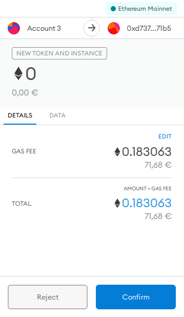
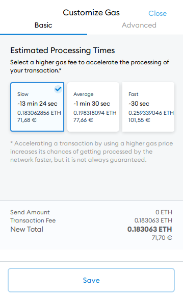
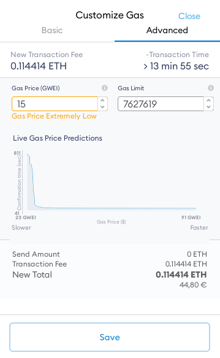

You've decided you want to do something expensive on Ethereum. Maybe it's deploying a new [Aragon DAO](https://client.aragon.org/#/). The transaction price in MetaMask (as of writing) is €71. Ouch, that's a lot.

Most people don't know what this fee is for. That sucks. They could save on gas fees and go out for a nice dinner instead 🍲. Let's take a look at what we can do to have both a DAO and make that dinner happen.

## 🦊 The MetaMask layers of confusion

Welcome at the first layer:

Notice that little 'edit' button up there? If you don't know what you're doing it feels scary to click it right? Let's be cheeky and press it anyway! Welcome at the second layer:

So much information! And, it seems the €71 is already the cheapest possible!

False!

We still have the 'advanced' section to go visit for the true adventurers. Let's put on our helmet and dive into layer three:

This is where the magic happens; you can freely set the gas price. I've put it at 15 GWEI saving over €25!

> But Beer! That's off the charts and an 'extreme low' warning is showing!

Yeah! Who cares?

I recently did two transactions where I had set the price 'off the charts'. Let's go through what I got told and what ended up happening.

1. Recommended: 55 GWEI. Set at: 25 GWEI. Estimated wait time: > 1 hour. Actual wait time: 26 minutes. Saved: €6,-
2. Recommended: 25 GWEI. Set at: 15 GWEI. Estimated wait time: > 2 hours. Actual wait time: 3 minutes. Saved: €1,50

If you're in a hurry and you can't wait half an hour it makes sense to pay more. But, if you're doing a transaction that is fine to take 2 hours, I bet you can pay way less than what you're being told.

Go get your free dinner!

## 🥪 How MetaMask could help get your free dinner

It seems that MetaMask is biased towards fast transactions. The 'slow' option is still relatively fast. Why doesn't MetaMask show a 'turtle' option; where you're only paying half the price but wait a few hours?

It seems to be a problem in the wider Ethereum community. [Eth Gas Station](https://ethgasstation.info/) doesn't even show a 'slow' option. [Etherscan](https://etherscan.io/gastracker) does but again the 'slow' option is still relatively fast.

I can only wonder how many people are overpaying to make a transaction happen now while they could have waited for a few hours.
